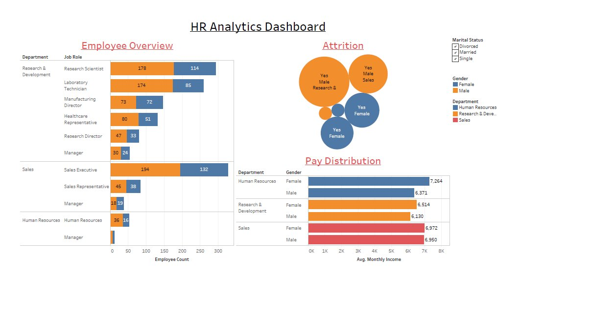

# HR Analytics Dashboard 📊

## Overview
This project presents an interactive HR Analytics Dashboard built using **Tableau**, providing insights into employee data, attrition, and pay distribution.

## Dashboard Preview

## Features
- 👥 **Employee Overview** – Department-wise and job role-wise employee count
- 📉 **Attrition Analysis** – Gender and department-wise attrition breakdown
- 💰 **Pay Distribution** – Average monthly income by department and gender

## Tools Used
- Tableau
- HR Employee Dataset

## Key Insights
- Research & Development has the highest employee count
- Sales Executive is the top job role in Sales department
- Female employees in Human Resources earn the highest average income (7,264)

## Files
- `HR_Analytics_Dashboard.png` – Dashboard screenshot
- `HR_Analytics_Report.pdf` – Detailed report

## Author
**LAXMI15PRIYA**
